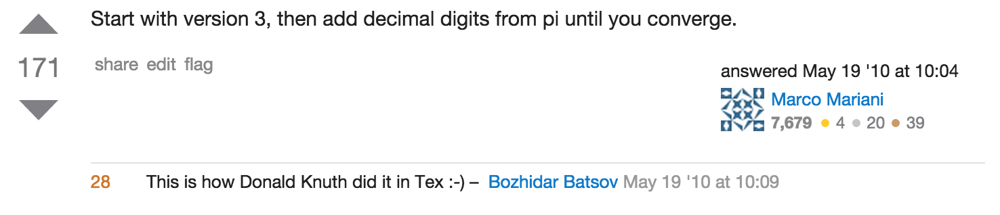

### Version 0.1.0 of my Semantic Versioning Knowledge
Semantive Versioning has a website: [Semantic Version](http://semver.org/)

# Disclaimer
* I don't know a whole lot about semantic versioning
* I've been trying to learn how to use it while helping maintain [medium-editor](https://github.com/yabwe/medium-editor)
* I've run into interesting circumstances and read some interesting stuff, so I'm sharing
* I'm hoping I can learn more about this from you guys, so please jump in

## Software Versioning

## Example (Build #)
* Every build, generate an increasing number
  * Timestamp
  * Generic build number
* Easy to implement
* Can't tell anything by looking at the version number (other than maybe date)
* Can't go back and insert fixes (have to make a new build)

### Pi based

## Examples
* Per software launch (what was used for Microsoft account)
  * Tied to version we were going to release (waterfall every ~6 months)
  * Start work on 1.0, launch it
  * Before 1.0 is complete, start next version (1.5)
    * Continually merge 1.0 code into 1.5 branch
    * Once 1.0 is launched, all hot-fixes merged into 1.5
  * During development, append the build number on each built candidate
    * 1.0.1234
* Easy to maintain
* A lot of pain with branches
* Waterfall is not great

## Examples
